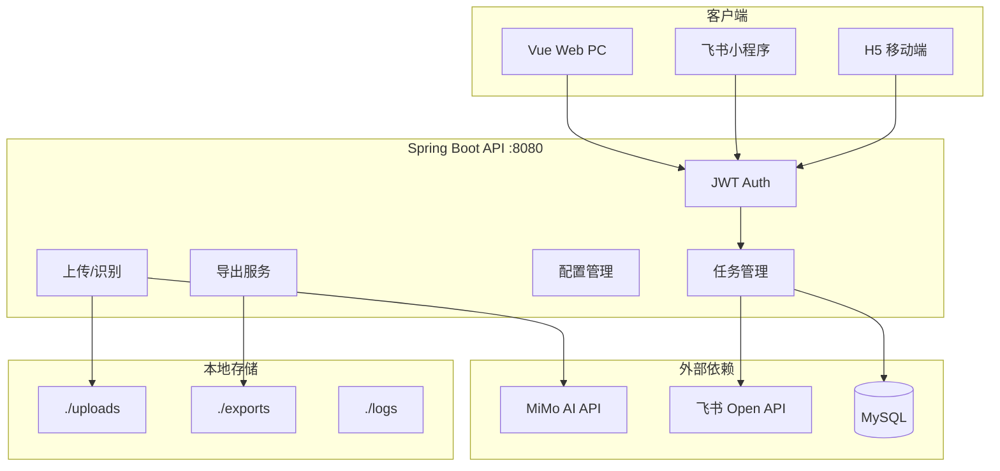

# AttendanceAgent 威胁模型

**版本：** 1.0  
**日期：** 2026-06-03  
**范围：** AttendanceAgent 全栈应用（后端 API、Web、飞书小程序、移动端）

---

## 1. 系统概述

AttendanceAgent 是企业考勤 AI 识别系统：用户上传考勤表图片/PDF → MiMo AI 解析 → 人工确认 → 同步至飞书多维表格 (Bitable) → 导出 Excel。

### 1.1 组件架构

### 1.2 部署假设（待运维确认）

| 假设 | 默认值 | 对风险的影响 |
|------|--------|--------------|
| 互联网暴露 | 企业内网 + 飞书 SaaS | 外网攻击面较小，但飞书用户可访问 |
| 多租户 | 单企业单实例 | 用户间数据隔离靠 user_id |
| 认证 | JWT Bearer，7 天有效 | 无吊销则泄露窗口大 |
| 生产 profile | `prod` + 环境变量 | 误配 dev 特性风险高 |

---

## 2. 信任边界

| 边界 | 协议 | 认证 | 主要风险 |
|------|------|------|----------|
| 客户端 ↔ API | HTTPS（生产应强制） | JWT Header/Query | Token 泄露、IDOR |
| API ↔ MySQL | JDBC | DB 凭证 | SQL 注入（当前低）、日志泄露 |
| API ↔ MiMo | HTTPS | API Key | 密钥泄露、费用滥用 |
| API ↔ 飞书 | HTTPS | App ID/Secret → tenant token | 凭证泄露、SSRF 式探测 |
| API ↔ 文件系统 | 本地 IO | 无 | 路径遍历 |
| 开发者 ↔ Git | HTTPS | Git 权限 | 敏感导出文件已入库 |

---

## 3. 资产清单

| 资产 | 敏感度 | 存储位置 |
|------|--------|----------|
| 员工考勤 PII（姓名、工号、时间） | 高 | MySQL tasks、exports、uploads |
| JWT Secret | 高 | 环境变量 |
| MiMo API Key | 高 | 环境变量 |
| 飞书 App Secret | 高 | 环境变量 |
| Bitable appToken/tableId | 高 | DB/配置文件/API 响应 |
| AI 识别提示词 | 中 | DB |
| 审计日志 | 中 | MySQL |
| 管理员账号 | 高 | MySQL |

---

## 4. 攻击者画像

### 4.1 外部匿名攻击者
- **能力：** 注册开放账号、调用公开 API、暴力破解登录
- **目标：** 进入系统、消耗 AI 配额、窃取考勤数据
- **不可能力：** 直接访问内网 DB（假设网络隔离）

### 4.2 已认证普通用户
- **能力：** 合法 JWT、上传文件、确认任务、调用部分配置 API
- **目标：** 读取他人任务/图片、获取 Bitable token、路径遍历读服务器文件
- **关键路径：** IDOR、C-01 路径遍历、H-01 配置泄露

### 4.3 恶意内部人员 / 被控账号
- **能力：** 长期有效 token、批量导出
- **目标：**  exfiltration 全员考勤、篡改 Bitable 同步

### 4.4 供应链 / 依赖攻击者
- **能力：** 利用 EOL 框架 CVE
- **目标：** RCE、反序列化

---

## 5. 威胁与滥用路径

### T-01 任意文件读取（Critical）
- **路径：** 污染 imageUrls → `/local/image/{traversal}` 
- **影响：** 配置文件、密钥、其他用户图片
- **现有控制：** requireFileAccess（不足）
- **优先级：** Critical

### T-02 跨用户数据访问（High）
- **路径：** 猜测 taskId、export jobId
- **影响：** 考勤数据泄露
- **现有控制：** TaskAccessService user_id 校验 ✅
- **优先级：** Low（当前实现较好）

### T-03 飞书凭证窃取（High）
- **路径：** `GET /config/country-bundle`
- **影响：** 读写企业 Bitable
- **现有控制：** 无
- **优先级：** High

### T-04 OAuth 登录劫持（High）
- **路径：** 伪造 OAuth callback
- **影响：** 受害者以攻击者身份登录
- **现有控制：** 无 state 校验
- **优先级：** High

### T-05 AI/API 成本耗尽（Medium）
- **路径：** 批量 `/local/upload-stream`、`/chat/image`
- **影响：** 财务损失、服务不可用
- **现有控制：** 无速率限制
- **优先级：** Medium

### T-06 日志与 Git 数据泄露（Critical/High）
- **路径：** 日志聚合平台、公开/共享 Git 仓库
- **影响：** PII 大规模泄露
- **现有控制：** .gitignore 不完整
- **优先级：** Critical

### T-07 全局配置篡改（High）
- **路径：** `PUT /config/current-country`
- **影响：** 错误国家识别、错误 Bitable 写入
- **现有控制：** 无 admin 校验
- **优先级：** High

### T-08 提示词注入（Medium）
- **路径：** 考勤图片中含恶意文字影响 AI 输出
- **影响：** 错误识别结果、潜在 prompt 泄露
- **现有控制：** RecognitionPromptGuard 过滤示例行
- **优先级：** Medium（业务逻辑风险）

---

## 6. 现有安全控制（证据）

| 控制 | 状态 | 证据 |
|------|------|------|
| 密码 BCrypt | ✅ | `PasswordEncoder.java` |
| JWT 认证 | ✅ | `JwtAuthenticationFilter` |
| 任务归属校验 | ✅ | `TaskAccessService.requireTaskOwner` |
| Admin 接口保护 | ⚠️ 部分 | User/Config/Audit 有；country-bundle 无 |
| 上传类型校验 | ✅ | `ImageUploadValidator` |
| SQL 参数化 | ✅ | MyBatis `#{}` |
| 审计日志 | ✅ | `AuditLogService` |
| 速率限制 | ❌ | 未发现 |
| Token 吊销 | ❌ | 无 |
| WAF/安全头 | ❓ | 不在代码库 |

---

## 7. 缓解措施建议

| 威胁 | 推荐缓解 | 实施位置 |
|------|----------|----------|
| T-01 | 路径规范化 + imageUrl 白名单 | `LocalUploadController`, `TaskService` |
| T-03 | 配置 API 分级 DTO | `ConfigController` |
| T-04 | OAuth state + PKCE | `FeishuAuthController` |
| T-05 | 限流 + AI quota | Gateway / Filter |
| T-06 | gitignore + 日志脱敏 | 仓库策略、application-prod.yml |
| T-07 | admin 鉴权 | `ConfigController` |
| 通用 | 升级 Spring Boot 3.x | `pom.xml` |
| 通用 | 关闭公开注册 | `AuthController` / 配置开关 |

---

## 8. 开放问题（需运维/产品确认）

1. 生产是否公网暴露？是否仅飞书 VPN/零信任？
2. 是否允许非员工自助注册？
3. `bootstrap-default-admin` 在生产是否已关闭？
4. 反向代理是否配置 HTTPS、安全头、限流？
5. 日志是否进入 SIEM？保留策略与访问权限？

---

*威胁模型基于仓库静态分析。假设未确认项已在第 8 节列出，确认后应更新优先级。*
