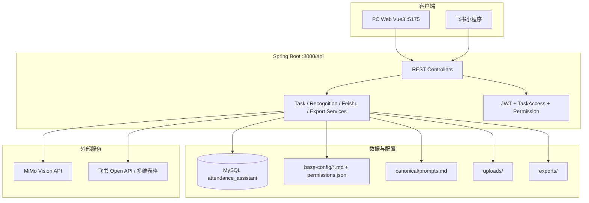
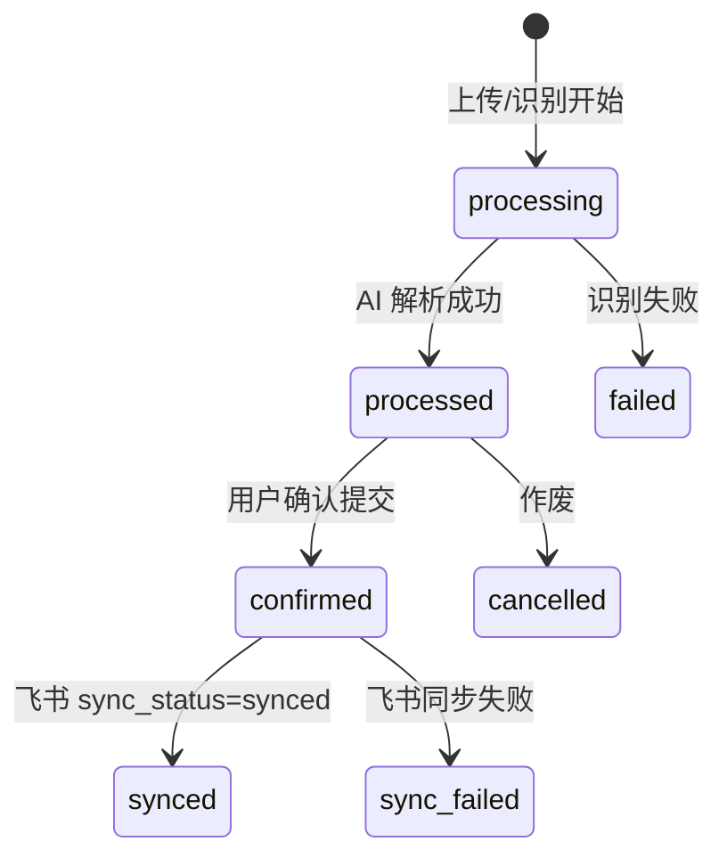

# 系统架构与配置设计

AttendanceAgent（AI 考勤助手）将考勤表拍照识别、人工核对、飞书多维表格同步串联为一条流水线。本文描述部署拓扑、配置分层、初始化流程与多端一致性约定。

## 1. 总体架构



| 层级 | 技术 | 说明 |
|------|------|------|
| PC 前端 | Vue 3 + Vite + Element Plus | 任务编辑、配置、导出、权限管理；开发端口 **5175** |
| 飞书小程序 | 原生小程序（TTML） | 拍照上传、待核对、记录修改/校准 |
| 后端 | Spring Boot 2.7 + MyBatis | 上下文路径 `/api`，默认端口 **3000** |
| 数据库 | MySQL 8.0 | 任务、用户、提示词、导出、审计 |
| AI | MiMo Vision（流式） | 识图模型默认 `mimo-v2.5` |

## 2. 配置分层

配置分为四层，避免混用：

```
┌─────────────────────────────────────────────────────────┐
│ 1. 环境变量 / backend/.env（密钥、DB、JWT、飞书 App）      │
├─────────────────────────────────────────────────────────┤
│ 2. application.yml / application-dev.yml（框架与开关）    │
├─────────────────────────────────────────────────────────┤
│ 3. base-config/（业务可编辑：飞书映射、权限、提示词源）    │
├─────────────────────────────────────────────────────────┤
│ 4. MySQL（任务数据、recognition_prompt、export_jobs）     │
└─────────────────────────────────────────────────────────┘
```

### 2.1 环境变量（敏感）

| 变量 | 用途 |
|------|------|
| `DB_HOST` / `DB_PORT` / `DB_NAME` / `DB_USER` / `DB_PASSWORD` | MySQL 连接 |
| `JWT_SECRET` | JWT 签名（生产必须修改） |
| `FEISHU_APP_ID` / `FEISHU_APP_SECRET` | 飞书应用 |
| `FEISHU_REDIRECT_URI` | OAuth 回调，默认 `http://localhost:3000/api/feishu-auth/callback` |
| `MIMO_API_KEY` / `MIMO_MODEL` | 识图 API |
| `BITABLE_APP_TOKEN` / `BITABLE_TABLE_ID` | 可选全局默认（多国以 `feishu.md` 为准） |

开发配置见 `backend/src/main/resources/application-dev.yml`（含 `attendance.bootstrap-default-admin: true`）。

### 2.2 应用配置项（`attendance.*`）

| 配置 | 默认 | 说明 |
|------|------|------|
| `attendance.prompt.seed-on-startup` | `true` | 启动时播种 `recognition_prompt` |
| `attendance.prompt.force-seed-on-startup` | `false` | `true` 时强制覆盖全部国家提示词 |
| `attendance.prompt.seed-version` | `2` | 模板版本，升级字段后递增 |
| `attendance.bootstrap-default-admin` | dev:`true` | 自动创建/校正 admin 账号 |
| `export.path` / `export.retention-days` | `./exports` / `7` | 异步导出文件 |

### 2.3 base-config（文件型业务配置）

详见 [base-config/README.md](../base-config/README.md)。

- **`feishu.md`**：按国家配置 Bitable 与字段映射；确认任务后 `FeishuSyncService` 写入飞书。
- **`prompts.md`**：提示词编辑源；运行时以表 **`recognition_prompt`** 为准。
- **`permissions.json`**：`PermissionService` 加载；控制 PC 菜单与 `recordCalibrate` 等。
- **`countries.md`**：国家参考信息；有效国家列表由 Catalog + 配置文件章节合并。

`ConfigPathResolver` 从下列路径查找 `base-config`（命中含 `prompts.md` 的目录）：

1. `{cwd}/base-config`
2. `{cwd}/../base-config`
3. `{cwd}/../../base-config`

### 2.4 数据库配置态

| 存储 | 内容 |
|------|------|
| `recognition_prompt` | 各国 `ai_prompt`、`continue_prompt`、`user_modified` |
| `plugin_config` | 历史键值（init 仍写入默认映射）；新业务不依赖 |
| `tasks.confirmed_data` | 已确认员工记录 JSON（含 `_calibrationHistory`、`_manualCalibrated`） |
| `tasks.prompt_country` | 识别时工作国家快照 |

## 3. 初始化与启动顺序

### 3.1 首次部署 checklist

1. 安装 JDK 8+、Maven、Node 18+、MySQL 8+。
2. 执行 `backend/config/init.sql`（见 [backend/config/README.md](../backend/config/README.md)）。
3. 配置 `backend/.env`（可复制团队模板；仓库内若有 `.env.example` 以对齐键名）。
4. 按需编辑 `base-config/feishu.md`、`permissions.json`。
5. 启动后端：`cd backend && mvn spring-boot:run`（或 `./start.sh backend`）。
6. 启动前端：`cd frontend && npm run dev` → http://localhost:5175/
7. 使用 `admin` / `admin123` 登录（生产务必改密并关闭 bootstrap）。

### 3.2 应用启动自举（Java）

| 顺序 | 类 | 作用 |
|------|-----|------|
| @Order(15) | `ExportJobDatabaseBootstrap` | 确保 `export_jobs` 表及 `dismissed_at` |
| @Order(20) | `PromptDatabaseBootstrap` | 确保 `recognition_prompt` 并播种 |
| 默认 | `DefaultAdminBootstrap` | dev 下校正 admin（`ConditionalOnProperty`） |

### 3.3 启动脚本

| 脚本 | 说明 |
|------|------|
| `start.sh` | Linux/macOS：`all` / `backend` / `frontend` / `init` |
| `start.bat` | Windows 同等能力（若存在） |

前端开发端口以 `frontend/vite.config.js` 为准（**5175**，`strictPort: true`）。

## 4. 核心业务流程



- **待核对**（`processed`）：PC/小程序可编辑记录字段；小程序「修改」写回内存后一并 `confirm`。
- **已确认**（`confirmed`）：只读；有 `recordCalibrate` 权限者可「校准」，写回 `confirmed_data` 并异步同步飞书（`_feishuRecordId` / 按任务号+工号查找）。

任务汇总统计以 **`GET /api/tasks/summary`** 为单一事实来源，见 [data-consistency.md](./data-consistency.md)。

## 5. 安全与权限

- **认证**：PC 用户名密码 JWT；小程序飞书 OAuth → 绑定 `users.feishu_user_id`。
- **任务访问**：`TaskAccessService` — 普通用户仅本人任务；`admin` 可访问全部。
- **功能权限**：`PermissionService` + `base-config/permissions.json`；管理员始终拥有校准等管理项。
- **配置 API**：飞书/提示词/用户/权限写操作需管理员（`AdminAuthService`）。

## 6. 仓库目录（与配置相关）

```
AttendanceAgent/
├── base-config/           # 飞书、提示词源、权限（运行时读取）
├── backend/
│   ├── config/
│   │   ├── init.sql       # 全量建库
│   │   ├── migration/     # 增量脚本 001–006
│   │   └── README.md      # 数据库文档
│   └── src/main/resources/
│       ├── application.yml
│       ├── application-dev.yml
│       └── canonical/prompts.md
├── frontend/              # PC，端口 5175
├── feishu-miniprogram/    # 小程序 config.js → API 基址
├── docs/
│   ├── architecture-and-config.md  # 本文
│   └── data-consistency.md
└── start.sh
```

## 7. 相关文档

- [backend/config/README.md](../backend/config/README.md) — SQL 初始化与迁移
- [base-config/README.md](../base-config/README.md) — 各配置文件说明
- [data-consistency.md](./data-consistency.md) — 任务状态与多端统计约定
- [design-system.md](./design-system.md) — PC 端 UI 设计 token（若有前端改版可参考）
- [README.md](../README.md) — 快速开始
