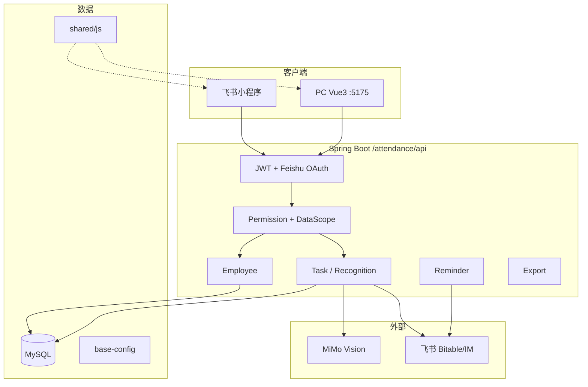

# 项目需求开发路线图

> 架构师视角 | 2026-07-08  
> Agent Skill: `.cursor/skills/attendance-architect-agent/`

## 系统全景



## Agent 分工

| Agent | Skill 路径 | 职责 |
|-------|-----------|------|
| 产品经理 | `.cursor/skills/attendance-pm-agent/` | PRD、用户旅程、验收标准、SOP |
| **系统架构师** | `.cursor/skills/attendance-architect-agent/` | 技术方案、契约、分阶段交付、ADR |
| 代码评审 | `.cursor/skills/attendance-code-review-agent/` | 实现后多维度审查 |

**推荐流程：** PM 写需求 → 架构师出技术方案 → 开发实现 → 代码评审

## 需求清单与状态

| 需求 | 文档 | 状态 | 优先级 | 技术方案 |
|------|------|------|--------|----------|
| 多角色 RBAC + 数据范围 | — | **开发中** | P0 | [rbac-data-scope-design.md](./rbac-data-scope-design.md) |
| 任务提醒 | [task-reminder.md](../requirements/task-reminder.md) | 开发中 | P1 | `docs/implementation/task-reminder-plan.md` |
| 员工管理 | — | 开发中 | P1 | 随 RBAC work_region 维度 |
| 会话加固 | — | 开发中 | P2 | sessionGuard + authFailure |
| 工作国家/区域 | — | 开发中 | P1 | CountryCatalog + X-Country |

## 当前迭代重点（P0）

工作区变更集中在 **RBAC 演进**，建议按以下顺序收尾：

### 1. 数据层闭环
- [ ] 确认 migration 023/024 在现有 DB 可重复执行
- [ ] `init.sql` 与 migration 对齐（新环境一键初始化）
- [ ] Bootstrap runners 顺序与幂等性验证

### 2. 服务层闭环
- [ ] `DataScopeService` 覆盖 tasks / task_records / employees / export
- [ ] `UserRoleService` 主角色同步无遗漏
- [ ] `AdminAuthService` 基于 user_role 而非仅 users.role

### 3. API + 前端闭环
- [ ] 角色管理全流程（CRUD + 成员 + 权限 + 范围）
- [ ] 用户管理多角色选择
- [ ] `refreshPermissions` 在角色变更后生效

### 4. 文档与测试
- [ ] 更新 `docs/data-consistency.md` 数据范围章节
- [ ] 关键路径集成测试
- [ ] `attendance-code-review-agent` 全量审查

## 下一迭代候选（P1）

1. **任务提醒 MVP 收尾** — 按 `task-reminder.md` 验收，调度器 + 站内 + 飞书
2. **小程序权限对齐** — 确保 recordCalibrate 等国别权限与 PC 一致
3. **data-consistency 文档统一** — 反映维度数据范围而非二元 admin/user

## 使用架构师 Agent

在 Cursor 中提及以下关键词将自动启用架构师 Skill：

- 架构师、系统设计、技术方案
- 需求开发、API 设计、数据库设计
- ADR、模块划分、端到端开发

示例提示词：

```
以架构师身份，为 [功能名] 编写技术方案并实现 MVP
```

```
审查当前 RBAC 分支的架构风险，给出分阶段建议
```

## 关键不变量（开发时必守）

1. 任务统计只信 `GET /tasks/summary`
2. 写操作必须 JWT + 权限/范围检查
3. JDK 8 兼容
4. 新功能至少 zh-CN + en-US 文案
5. 跨端逻辑放 `shared/js` 并 sync 到小程序
