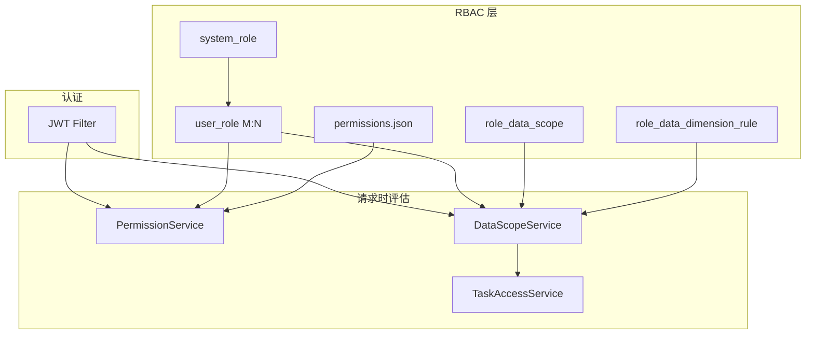

# 多角色 RBAC 与数据范围 — 技术方案

> 状态：**已落地**（init.sql / migrate_all.sh / 023–024 已对齐）  
> 关联：`docs/architecture-and-config.md`、`docs/data-consistency.md`  
> 迁移：`009`–`010`、`023`、`024`

## 1. 目标与验收

**业务目标：** 从二元 admin/user 模型演进为可配置多角色 RBAC，支持功能权限与多维度数据范围，满足跨国仓储/代理场景的精细化管控。

**验收标准：**
- [ ] 管理员可创建自定义角色，配置功能权限（菜单/操作）与数据范围
- [ ] 用户可拥有多个角色；有效权限为所有角色并集
- [ ] 管理员可为角色分配成员；`users.role` 保持主角色兼容
- [ ] 数据范围支持 `owner_user`、`country`、`warehouse`、`agency`、`work_region`
- [ ] 任务列表/汇总/导出/员工管理均受数据范围约束
- [ ] PC 设置页：角色管理、用户管理、数据范围配置可用
- [ ] 现有 admin 账号行为不退化（全权限 + 全数据）

**非目标（本阶段）：**
- 小程序端角色管理 UI
- 细粒度字段级权限
- 外部 SSO / LDAP

**客户端：** PC 为主；小程序沿用登录用户权限，无管理界面

## 2. 现状架构



**历史模型：** `users.role` = `admin` | `user`；admin 看全部，user 仅本人。  
**目标模型：** `user_role` 多对多 + 维度规则并集。

## 3. 数据模型

### 核心表

| 表 | 用途 |
|----|------|
| `system_role` | 角色定义（`role_key`, `role_name`, `built_in`） |
| `user_role` | 用户↔角色 M:N |
| `role_data_scope` | 每角色 `all` 或 `restricted` |
| `role_data_dimension_rule` | 维度规则（dimension + values JSON） |

### 迁移清单

| 文件 | 内容 |
|------|------|
| `009_role_data_scope.sql` | scope + dimension 表 |
| `010_system_role.sql` | system_role |
| `023_user_roles.sql` | user_role + 从 users.role 回填 |
| `024_role_data_scope_work_region.sql` | work_region 维度 |

### Bootstrap

- `UserRoleDatabaseBootstrap` — 确保 user_role 表存在并迁移遗留数据
- `RoleDataScopeDatabaseBootstrap` — 确保 scope 表存在

### 兼容策略

- `users.role` = **主角色**（admin > 自定义 > user），用于展示与旧接口
- `UserRoleService.syncPrimaryRole()` 在角色变更时同步

## 4. API 契约

| Method | Path | Permission | 说明 |
|--------|------|------------|------|
| GET | `/roles` | admin | 角色列表 |
| POST | `/roles` | admin | 创建角色 |
| POST | `/roles/{key}/update` | admin | 更新 |
| POST | `/roles/{key}/delete` | admin | 删除（非 built_in） |
| GET | `/roles/{key}/members` | admin | 成员列表 |
| POST | `/roles/{key}/members` | admin | 批量更新成员 |
| GET | `/data-scope/roles/{key}` | admin | 获取范围配置 |
| POST | `/data-scope/roles/{key}` | admin | 保存范围配置 |
| GET | `/data-scope/me` | JWT | 当前用户范围自省 |
| GET | `/permissions` | JWT | 有效功能权限 |
| POST | `/users` | users | 创建用户（含 roleKeys） |
| POST | `/users/{id}/update` | users | 更新含多角色 |

**LoginResponse 扩展：** `roles[]`, `workingCountry`, `personalWorkingCountry`

## 5. 权限与数据范围

### 功能权限

- 源：`base-config/permissions.json` + `permissions-by-country.json`
- 评估：`PermissionService.effectivePermissions(userId)` — 多角色并集
- admin 角色：代码层全能力，不可编辑

### 数据范围

```
resolveForCurrentUser():
  if any role is admin → all users
  if any role scope = all → all users
  else union dimension rules across restricted roles
  if restricted but no rules → self only (owner_user = current user)
```

**注入点：** `TaskService`, `EmployeeService`, `ExportJobService` 等通过 `DataScopeContext` 传入 MyBatis。

### 维度映射

| 维度 | 过滤实体 | 字段来源 |
|------|----------|----------|
| owner_user | tasks | `tasks.user_id` |
| country | task_records | `country` |
| warehouse | task_records | `warehouse` |
| agency | task_records | `agency` |
| work_region | employees | `work_region` |

## 6. 前端

| 路由 | 组件 | 说明 |
|------|------|------|
| `/settings/roles` | `RoleManagement.vue` | 角色 CRUD + 权限 + 数据范围 + 成员 |
| `/settings/users` | `UserManagement.vue` | 多角色选择 |
| — | `ProfileModal.vue` | 个人信息与工作国家 |
| — | `sessionGuard.js` | 会话超时与鉴权失败处理 |

**Store：** `auth.js` — `roles`, `hasPermission()`, `refreshPermissions(workingCountry)`  
**守卫：** `settingsAccess.js` — 路由级能力检查

## 7. 分阶段交付

| 阶段 | 范围 | 状态 |
|------|------|------|
| **P1 MVP** | 表结构 + UserRoleService + 角色管理 API/UI | 进行中 |
| **P2** | DataScopeService 全链路 + work_region | 进行中 |
| **P3** | 会话加固 + Profile + 工作国家 | 进行中 |
| **P4** | 员工模块 + work_region 范围 | 进行中 |
| **P5** | 文档对齐 + 回归测试 + data-consistency 更新 | 待办 |

## 8. 风险与回滚

| 风险 | 缓解 | 回滚 |
|------|------|------|
| 范围配置错误导致数据不可见 | `/data-scope/me` 自省 + 管理员可改 | 将角色 scope 改为 all |
| 多角色并集过大 | 管理端预览有效权限 | 减少角色分配 |
| users.role 与 user_role 不一致 | syncPrimaryRole 每次变更触发 | 重跑 023 迁移回填 |
| 导出范围泄漏 | ExportJob 写入 allUsersScope | 已有模式，需验证新 scope |

## 9. 测试计划

- [ ] 单角色 user：仅本人任务
- [ ] 自定义角色 restricted + country=FR：仅 FR 记录
- [ ] 多角色并集：两角色各限制不同维度 → 可见并集
- [ ] admin：全量不受限
- [ ] 角色成员批量更新后 JWT 刷新权限
- [ ] `GET /tasks/summary` 数字与列表 total 一致
- [ ] 导出文件行数与列表范围一致

## 10. 待更新文档

- [ ] `docs/data-consistency.md` §数据范围 — 从二元模型更新为维度模型
- [ ] `base-config/permissions.json` 注释
- [ ] SOP 管理员章节（角色管理流程）
